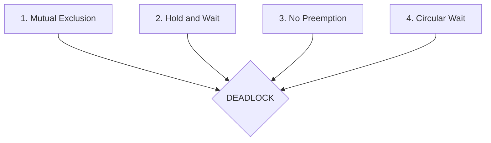
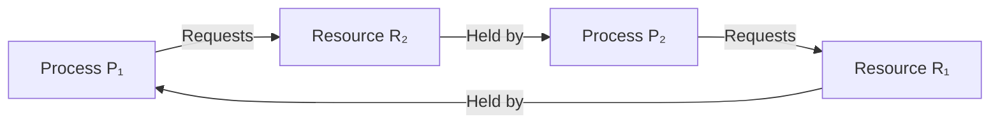

# 🔒 01.1 - Deadlock Theory & The 4 Coffman Invariants

> [!TIP]
> **Core Intuition in 1 Sentence:**  
> A deadlock is a permanent standstill where multiple processes each hold a resource that another needs, and neither can proceed or let go.

---

## 💡 Real-Life Intuitions (The "Aha!" Mental Models)

### 1. The Narrow Mountain Bridge (Gridlock)
Two stubborn drivers meet head-on in the middle of a single-lane mountain bridge:
* **Car A** cannot move forward because **Car B** occupies the road ahead.
* **Car B** cannot move forward because **Car A** occupies the road ahead.
* Neither driver reverses (**Hold and Wait**).
* No police tow truck can legally seize either car (**No Preemption**).
* The single-lane bridge fits only one vehicle (**Mutual Exclusion**).
* A closed loop of waiting exists (**Circular Wait**).
Zero forward progress can ever occur.

### 2. The Empty-Handed ATM Customer (Hold & Wait Clarified)
* If you stand in line at an ATM with empty hands, you are merely **waiting**. You hold nothing hostage. No deadlock can form.
* But if you insert your card, type your amount, and **stand there holding the ATM door open** while waiting for a friend to bring cash from across town, you are **holding AND waiting**.

---

## ⚙️ The Formal OS Kernel Definition

A **Deadlock** is a state in which every process in a set:

$$P = \{P_1, P_2, \dots, P_n\}$$

is permanently blocked waiting for an event (resource release) that can **only** be triggered by another process within that exact same set $P$.

### What Qualifies as a Resource?
* **Hardware Resources:** Physical RAM frames, GPU streams, printer spoolers, disk controllers, network ports.
* **Software Resources:** Mutexes (`pthread_mutex_t`), spinlocks, semaphore units, database record locks, file descriptors.

---

## 🏛️ The 4 Coffman Conditions (1971)

Proved by Edward G. Coffman Jr., a system deadlock occurs **if and only if ALL FOUR** of the following conditions hold simultaneously:

| Condition | Formal Technical Specification | Physical Manifestation |
| :--- | :--- | :--- |
| **1. Mutual Exclusion** | At least one resource must be held in a non-shareable mode. | Only one thread/process can use the resource at any given moment (e.g., an exclusive write lock). |
| **2. Hold and Wait** | A process must be actively holding at least one resource while concurrently waiting to acquire additional resources held by peers. | Process $P_1$ holds Mutex A and requests Mutex B without releasing Mutex A. |
| **3. No Preemption** | Resources cannot be forcibly confiscated from a process by the OS. | A resource is released *only voluntarily* by the process after task completion (Note: preemption $\ne$ process termination). |
| **4. Circular Wait** | A closed dependency cycle exists: $P_0 \to P_1 \to P_2 \dots \to P_n \to P_0$, where each process waits for a resource held by the next. | $P_1$ waits for a lock held by $P_2$, while $P_2$ waits for a lock held by $P_1$. |

---

## 🎯 The Architectural Invariant (The Coffman Axiom)



> [!IMPORTANT]
> **Subatomic Invariant:**  
> $$\text{Deadlock} \iff \text{Mutual Exclusion} \land \text{Hold \& Wait} \land \text{No Preemption} \land \text{Circular Wait}$$  
> **Invalidate even ONE single condition, and deadlock becomes physically and mathematically impossible.**

---

## 🔄 Resource Allocation Graph (RAG) Visualization

In an OS Resource Allocation Graph:
* **Circles** represent **Processes** ($P_1, P_2$).
* **Rectangles** represent **Resources** ($R_1, R_2$).
* **Request Edge ($P \to R$):** Directed edge from Process to Resource indicates an active pending request.
* **Assignment Edge ($R \to P$):** Directed edge from Resource to Process indicates the resource is currently held.



### The Golden Single vs. Multi-Instance Invariant:
* **Single-Instance Resources (1 unit per resource):**  
  $$\text{Cycle in RAG} \iff \text{Deadlock (100\% Guaranteed)}$$  
  *(A cycle is both necessary and sufficient).*
* **Multi-Instance Resources (Multiple units per resource):**  
  $$\text{Cycle in RAG} \implies \text{Possible Deadlock (NOT Guaranteed)}$$  
  *(A cycle is necessary, but NOT sufficient. An external process holding an instance outside the cycle can finish and release its unit, breaking the deadlock).*

---

## 🛡️ How Operating Systems Attack Each Condition (Deadlock Prevention)

Operating systems eliminate deadlocks at design time by structurally forbidding at least one Coffman condition:

### 1. Attacking Mutual Exclusion
* **Strategy:** Make resources shareable or virtualized.
* **Kernel Technique:** Read-only access to files; spooling (e.g., a print daemon where print jobs queue into files on disk, decoupling physical hardware exclusivity from user processes).

### 2. Attacking Hold and Wait
* **Strategy:** Conservative resource acquisition.
* **Kernel Technique:** A process must request **all** required resources simultaneously before execution begins. If even one resource cannot be allocated, the process receives none and waits.
* **Trade-off:** High resource underutilization (holding a GPU for an entire job even if it is only used at the end).

### 3. Attacking No Preemption
* **Strategy:** Forcible resource revocation.
* **Kernel Technique:** If a process holding resources requests another resource that is currently allocated to someone else, the OS suspends the requesting process and **forcibly confiscates** all its currently held resources, returning them to the available pool. The process stays alive and is restarted later.

### 4. Attacking Circular Wait (Most Common in Real Systems)
* **Strategy:** Strict linear resource hierarchy.
* **Kernel Technique:** Define a 1-to-1 global ordering function $F: R \to \mathbb{N}$ over all resources:
  $$F(\text{Disk}) = 1, \quad F(\text{Network Socket}) = 2, \quad F(\text{Database Lock}) = 3$$
* **Rule:** A process can only request resources in **strictly ascending numerical order** ($F(R_i) < F(R_j)$). A process holding Resource 3 can *never* request Resource 1.
* **Mathematical Proof:** If every process requests resources in strictly increasing order, a closed dependency cycle ($A \to B \to C \to A$) would require:
  $$F(A) < F(B) < F(C) < F(A) \implies F(A) < F(A)$$
  which is a mathematical contradiction. Circular wait is eliminated.

---

## 💻 Concurrency Code Autopsy (C / POSIX Mutexes)

### The Buggy Anti-Pattern (Circular Wait in Code):
```c
// Thread 1: Acquires 1, then waits for 2
pthread_mutex_lock(&mutex_A); // ID 1
pthread_mutex_lock(&mutex_B); // ID 2
// ... critical section ...
pthread_mutex_unlock(&mutex_B);
pthread_mutex_unlock(&mutex_A);

// Thread 2: Acquires 2, then waits for 1 (VIOLATION!)
pthread_mutex_lock(&mutex_B); // ID 2
pthread_mutex_lock(&mutex_A); // ID 1
// ... critical section ...
pthread_mutex_unlock(&mutex_A);
pthread_mutex_unlock(&mutex_B);
```
*If Thread 1 grabs `mutex_A` at the same instant Thread 2 grabs `mutex_B`, the application locks up permanently.*

### The Correct Refactoring (Ascending Lock Hierarchy):
```c
// Thread 2 Refactored: ALWAYS acquire in ascending numerical order (1 -> 2)
pthread_mutex_lock(&mutex_A); // ID 1 (Must wait here first if Thread 1 holds it)
pthread_mutex_lock(&mutex_B); // ID 2
// ... critical section ...
pthread_mutex_unlock(&mutex_B);
pthread_mutex_unlock(&mutex_A);
```
*Because Thread 2 waits on Lock 1 before touching Lock 2, Thread 1 can acquire Lock 2 without contention, finish, and unlock both.*

---

## 🔢 The Universal Deadlock-Free Resource Threshold Formula

When $n$ concurrent processes each require at most $k$ units of a shared resource type, what is the minimum number of units $m$ the system must possess to guarantee that a deadlock can **never** occur?

### The Pigeonhole Worst-Case Derivation:
1. **Worst-Case Stall (Maximum Greed):** Every single process acquires $k - 1$ units and refuses to release them while waiting for its final 1 unit.
   $$\text{Total resources locked up} = n \times (k - 1)$$
2. **Breaking the Stall:** Add **just 1 extra unit** to the entire system.
   $$m \ge n(k - 1) + 1$$
3. **The Domino Effect:** That single extra unit is allocated to *any* process, allowing it to satisfy its maximum demand $k$. It finishes, releases all $k$ units back to the pool, and all remaining processes complete in sequence.

### Worked Example:
* For $n = 5$ flight tasks, each requiring at most $k = 2$ channels:
  $$m = 5 \times (2 - 1) + 1 = 5(1) + 1 = \mathbf{6 \text{ channels}}$$

---

## ⚡ High-Yield Exam Traps & Rapid Review

| Trap Question | Common Misconception | Ground-Truth Reality |
| :--- | :--- | :--- |
| *"Is a cycle in a Resource Allocation Graph always a deadlock?"* | Yes, cycles always mean deadlock. | **Only if single-instance resources.** If resources have multiple instances, a cycle can exist without deadlock. |
| *"Can mutual exclusion always be eliminated to prevent deadlock?"* | Yes, we can just share everything. | **No.** Intrinsically unshareable resources (write locks, physical hardware) cannot safely be shared without corrupting state. |
| *"Which prevention strategy is most practical in production kernels?"* | Forcing processes to ask for everything at boot. | **Ascending resource ordering $F(R)$**, because it eliminates Circular Wait without dynamic tracking overhead. |
| *"Does preemption mean killing a process?"* | Yes, preemption terminates the process. | **No.** Preemption revokes the *resource* and suspends the process. Process termination is a recovery mechanism. |

---

## 🧠 Socratic Mastery Record

* **Concept 1.1 Status:** Verified & Cleared.
* **Mastery Criteria Met:**
  * [x] Accurate oral explanation of 4 Coffman conditions.
  * [x] Distinction between Hold & Wait possession vs. simple queue waiting.
  * [x] Resource preemption distinguished from process termination.
  * [x] Single-instance vs. multi-instance RAG cycle conditions.
  * [x] Mathematical threshold calculation $m = n(k - 1) + 1$.
  * [x] C POSIX mutex ascending order refactoring.
