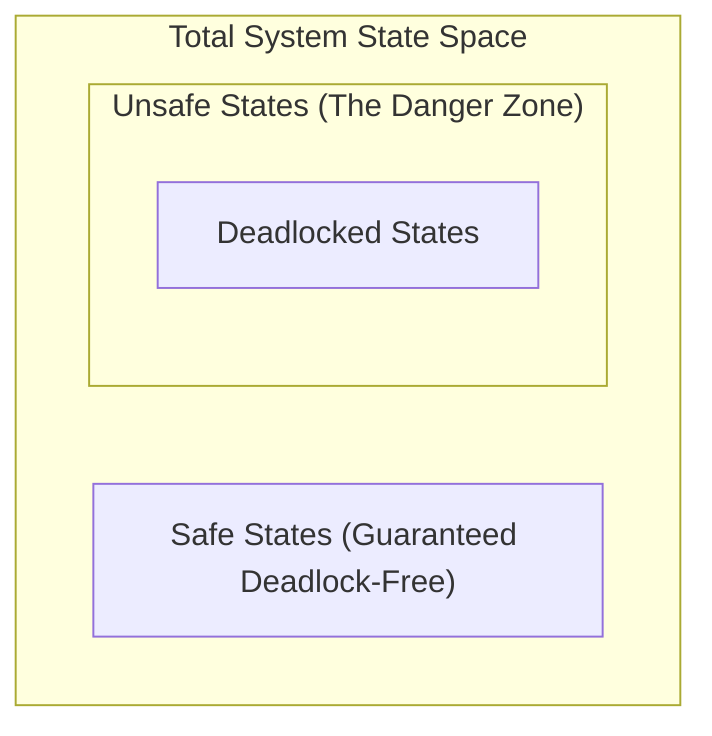
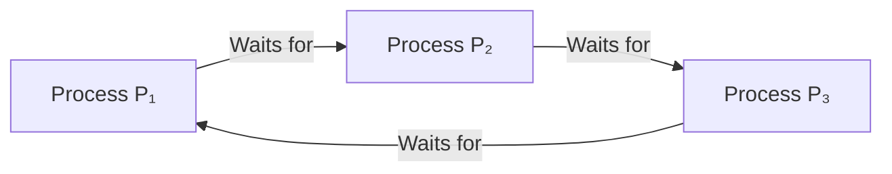

# 🛡️ 01.2 - Deadlock Handling: Prevention, Avoidance & Detection

> [!TIP]
> **Core Architectural Trade-off:**  
> * **Prevention:** Statically eliminates at least one Coffman condition at design time (zero runtime overhead; severe resource underutilization).  
> * **Avoidance:** Dynamically inspects allocation requests using **Dijkstra's Banker's Algorithm** to steer clear of Unsafe States (breaks zero conditions; requires declared max claims).  
> * **Detection & Recovery:** Grants resources optimistically; periodically scans the **Wait-For Graph** for cycles ($\mathcal{O}(V+E)$) and recovers via aborts or preemption.

---

## ✈️ 1. The Core Mental Model: Airport Runway Air Traffic Control

Imagine an airport managing how planes share a single busy runway:

### The 3 Control Philosophies
1. **Deadlock Prevention (The Rigid Rulebook):**  
   * *Analogy:* A rule stating no flight can push back from the gate in New York unless its runway, taxiway, and arrival gate in London are 100% pre-booked and locked for it right now.  
   * *Result:* Zero runway jams ever occur, but runways sit empty for hours while flights are delayed waiting for pre-allocated slots (**Severe Underutilization**).
2. **Deadlock Avoidance / Banker's Algorithm (The Smart Radar Controller):**  
   * *Analogy:* Planes taxi freely, but before any plane is cleared to enter the active runway, the radar controller simulates: *"Can all currently airborne planes safely land before their fuel runs out?"*  
   * *Result:* Runway clearance is granted **only if a safe landing sequence exists**. Breaks zero physical rules, but requires knowing fuel and flight plans in advance.
3. **Deadlock Detection & Recovery (The Emergency Tow-Truck):**  
   * *Analogy:* Planes taxi and land freely with zero advance checks. If two planes end up nose-to-nose on the tarmac freezing traffic, the airport dispatches a heavy tow-truck to drag one plane off into the grass (**Preemption / Abort**).  
   * *Result:* 100% runway utilization during normal operation, but incurs a disruptive recovery cost when gridlock occurs.

---

### Mapping the Metaphor to OS Kernel Terminology

| Airport Radar World | OS Kernel Reality |
| :--- | :--- |
| **Planes** | **Processes / Threads ($P_i$)** |
| **Runways, Taxiways, Gates** | **Shared Resources / Mutexes ($R_j$)** |
| **Air Traffic Controller** | **OS Kernel Scheduler / Resource Arbiter** |
| **Flight Max Fuel Demand** | **Declared Maximum Claim ($\text{Max}[i]$)** |
| **Guaranteed Safe Landing Order** | **Safe Sequence ($\langle P_0, P_1, \dots, P_{n-1} \rangle$)** |
| **Tarmac Tow-Truck & Preemption** | **Wait-For Graph Cycle Detection & Checkpoint Rollback** |

---

## 🏛️ 2. Architectural Comparison: The Three Paradigms

| Dimension | 1. Deadlock Prevention | 2. Deadlock Avoidance | 3. Deadlock Detection & Recovery |
| :--- | :--- | :--- | :--- |
| **Execution Phase** | Design time (compile / system rules) | Run time (evaluated on every request) | Post-mortem (periodic background checks) |
| **Coffman Invariants** | **Breaks 1 or more conditions** | **Breaks 0 conditions** | **Breaks 0 conditions** |
| **Future Knowledge** | None required | Requires declared $\text{Max}$ resource claim | None required |
| **Runtime Overhead** | Zero runtime calculation | High (matrix verification per request) | Low until a deadlock occurs |
| **Resource Utilization** | Low (conservative allocation) | Moderate to High | Maximum (optimistic allocation) |
| **Core Mechanism** | Ascending ordering $F(R)$, Hold-elimination | Dijkstra's Banker's Algorithm | Wait-For Graph cycle detection, rollbacks |

---

## 📐 3. State Space Topography: Safe vs. Unsafe vs. Deadlock

The state space of an operating system is partitioned into three nested domains:

### Theoretical Invariants:
1. **Safe State:** A state is safe if there exists at least one **Safe Sequence** $\langle P_0, P_1, \dots, P_{n-1} \rangle$ where every process can satisfy its maximum claim and terminate.
2. **Deadlock Immunity:** A system in a safe state is mathematically guaranteed to be free of deadlocks:
   $$\text{Safe State} \cap \text{Deadlock} = \emptyset$$
3. **Unsafe State $\ne$ Deadlock:** An unsafe state is **not yet deadlocked**. It is like driving on black ice: you haven't crashed yet, but the moment all processes concurrently demand their maximum declared limits, the system has no spare resources left to prevent a deadlock.
4. **Subset Invariant:** Deadlock is a strict subset of unsafe states:
   $$\text{Deadlock} \subset \text{Unsafe State} \subset \text{State Space}$$

---

## 🧮 4. Dijkstra's Banker's Algorithm (Avoidance Engine)

Banker's Algorithm ensures that resources are allocated only if the resulting system state remains **Safe**.

### The 4 Core Data Structures
For a system with $n$ processes and $m$ resource types:

| Data Structure | Type | Definition |
| :--- | :---: | :--- |
| **$\text{Available}$** | Vector ($1 \times m$) | Unallocated instances currently free in system memory. |
| **$\text{Max}$** | Matrix ($n \times m$) | Maximum resource demand declared by each process. |
| **$\text{Allocation}$** | Matrix ($n \times m$) | Instances currently held by each process. |
| **$\text{Need}$** | Matrix ($n \times m$) | Remaining resources required to complete:  $$\mathbf{\text{Need}[i][j] = \text{Max}[i][j] - \text{Allocation}[i][j]}$$ |

---

### Step-by-Step Numerical Example
Consider 3 processes ($P_0, P_1, P_2$) sharing **10 total instances** of a single resource type:
* **Total Instances:** $10$
* **Total Allocated:** $3 + 2 + 2 = 7$
* **$\text{Available}$ in Pool:** $10 - 7 = \mathbf{3}$

| Process | $\text{Allocation}$ | $\text{Max}$ | $\text{Need} = \text{Max} - \text{Alloc}$ | Simulation Decision Step |
| :---: | :---: | :---: | :---: | :--- |
| **$P_0$** | $3$ | $7$ | **$4$** | $\text{Need} (4) > \text{Available} (3) \implies$ Must wait. |
| **$P_1$** | $2$ | $5$ | **$3$** | $\text{Need} (3) \le \text{Available} (3) \implies$ Runs, finishes, returns $2$.  $\text{New Available} = 3 + 2 = \mathbf{5}$. |
| **$P_2$** | $2$ | $4$ | **$2$** | $\text{Need} (2) \le \text{Available} (5) \implies$ Runs, finishes, returns $2$.  $\text{New Available} = 5 + 2 = \mathbf{7}$. |

* Finally, $P_0$ requires $4 \le 7$, so $P_0$ finishes.
* **Safe Sequence:** $\langle P_1, P_2, P_0 \rangle \implies$ **System is in a SAFE STATE.**

> [!IMPORTANT]
> **Why Banker's Rejects Valid Requests:**  
> If $P_0$ requests $2$ more units when $\text{Available} = 3$, the system has enough free units to satisfy it physically.  
> However, after granting it, $\text{Available}$ drops to $1$, while remaining needs are $P_0: 2, P_1: 3, P_2: 2$.  
> Because **no process can finish** with $1$ unit, the state becomes **Unsafe**.  
> Therefore, Banker's Algorithm **denies the request and forces $P_0$ to wait**, protecting the system from entering an unsafe trajectory.

---

## 🔍 5. Deadlock Detection & System Recovery

When prevention and avoidance are omitted to maximize performance, kernels allow deadlocks to occur and rely on post-mortem detection.

### 1. Wait-For Graph (WFG)
For systems with **single-instance resources**, the Resource Allocation Graph collapses into a Wait-For Graph:
* **Vertices:** Processes only ($P_1, P_2, \dots$).
* **Directed Edge ($P_i \to P_j$):** Process $P_i$ is waiting for Process $P_j$ to release a lock.

* **Computational Check:** Depth-First Search / cycle detection in $\mathcal{O}(V + E)$ time.
* **Core Rule:** In a Wait-For Graph, a cycle is **necessary and sufficient for deadlock**.

---

### 2. Kernel Recovery Mechanisms

Once a cycle is detected, the operating system recovers via:

#### A. Process Termination
* **Abort All:** Kills all deadlocked processes simultaneously (high computation waste).
* **Abort Iteratively:** Aborts one process at a time until the cycle breaks.

#### B. Resource Preemption
* **Victim Selection:** Chooses the process with the lowest cost function (fewest resources held, least CPU time consumed).
* **Checkpoint Rollback:** The victim process is rolled back to a saved consistent checkpoint and suspended.
* **Starvation Defense (Aging):**  
  If the kernel repeatedly selects the lowest-cost process, that process starves and never terminates.  
  *Solution:* Maintain a victim counter. Each preemption increments the counter, raising its effective cost until the OS is forced to preempt a different process:
  $$\text{Effective Cost} = \text{Base Cost} + (\alpha \times \text{Victim Count})$$

---

## ⚡ 6. Rapid Revision Cheat Sheet (High-Yield MCQs)

| Question Pattern | Ground-Truth Technical Invariant |
| :--- | :--- |
| **Does Banker's Algorithm eliminate any Coffman condition?** | **No.** Avoidance breaks zero conditions; it dynamically steers around unsafe states. |
| **Is an unsafe state always a deadlock?** | **No.** An unsafe state merely carries the potential for deadlock if maximum claims are exercised. |
| **Can a cycle exist in a Wait-For Graph without a deadlock?** | **No.** Wait-For Graphs are defined strictly for single-instance resources; cycle $\iff$ deadlock. |
| **What is the time complexity of the Banker's Safety Algorithm?** | **$\mathcal{O}(m \cdot n^2)$**, where $n$ is the number of processes and $m$ is the number of resource types. |
| **How does an OS prevent starvation during resource preemption?** | By incorporating an **Aging counter** into the victim-selection cost function. |
| **What is the remaining need formula?** | $$\text{Need}[i] = \text{Max}[i] - \text{Allocation}[i]$$ |
